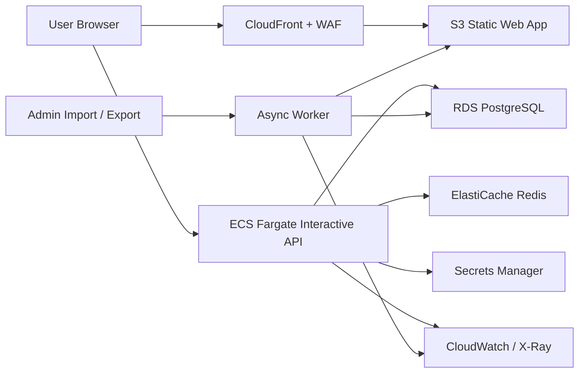

# AWS Target-State Architecture And Migration Blueprint

## 1. Design Goals

This target-state architecture is optimized for:

- very fast planning interactions
- minimal payload transfer
- bounded recalculation scope
- compatibility with the current Excel import/export contracts
- cost-aware UAT deployment in AWS
- clean migration path to production

## 2. Platform Decision

Selected platform: `AWS`

Recommended target runtime split:

- Web UI:
  - static build on `S3 + CloudFront`
- Interactive API:
  - `.NET 8` container on `Amazon ECS Fargate`
- Relational persistence:
  - `Amazon RDS for PostgreSQL`
- Hot cache:
  - `Amazon ElastiCache for Redis`
- Async job execution:
  - background worker on `ECS Fargate` or `Lambda` for admin jobs only
- Identity:
  - Microsoft Entra ID for web login
- Edge security:
  - `AWS WAF` on CloudFront

Phase strategy:

- Phase 1:
  - high-performance planning platform
  - all master-data and data-foundation readiness for later AI use
- Phase 2:
  - AI-powered merchandising, pricing, markdown, and forecast recommendation capabilities

## 2.1 Current Deployed UAT State

The live UAT deployment as of `2026-03-29` is:

- web:
  - `S3 + CloudFront`
- edge protection:
  - `AWS WAF` on CloudFront
- interactive API:
  - `.NET 8` on `ECS Fargate`
- persistence:
  - `Amazon RDS for PostgreSQL`
- active DB placement:
  - true private subnets via `sales-planning-demo-rds-private-subnets`
- auth:
  - Microsoft Entra web sign-in and backend API authorization

The live UAT deployment already reflects the core Phase 1 runtime decision, but several target-state improvements remain outstanding, especially:

- AG Grid SSRM
- async import/export jobs
- ALB HTTPS origin completion
- richer reconciliation and observability

## 3. Why This Replaces The Current Runtime Direction

The prior design path used:

- Lambda for interactive API
- SQLite compatibility/cache behavior
- large client-owned grid state

This creates avoidable performance problems:

- cold-start sensitivity
- payload ceiling pressure
- repeated hydration overhead
- whole-slice refresh after edits
- duplicated persistence work

The target design removes those constraints by:

- using a long-lived interactive API
- querying PostgreSQL directly
- serving only visible grid blocks
- returning changed-cell patches after commands
- separating synchronous planning from asynchronous admin and recommendation workloads

## 4. Target Topology

## 4.1 Live UAT topology delta

Current live UAT differs from the final target in these ways:

- Redis is not deployed yet
- workbook jobs are still synchronous
- ECS currently remains in the existing public subnets for UAT simplicity
- CloudFront-to-ALB traffic is still HTTP because ACM and Route 53 are not in place for the ALB hostname

## 5. Environment Strategy

### 5.1 UAT

UAT should optimize cost while preserving interactive performance:

- `1` ECS service for API
- `1` RDS PostgreSQL instance
- Redis optional at first, but recommended once product/profile volume remains large
- async import/export as a worker task, not request-time compute
- prefer one small always-on interactive service before introducing additional worker services
- keep non-critical off-hours scale-down options available if UAT operating hours allow them
- keep one active database only once rollback retention is no longer required

### 5.2 Production

Production should extend the same design:

- multiple ECS tasks across availability zones
- read and cache tuning
- stronger WAF and alerting
- blue/green deployment path
- separate async worker service

## 6. Exact Data Design

### 6.1 Principles

- PostgreSQL is the system of record
- no SQLite mirror/cache in the final interactive path
- no startup bootstrap import
- no request-time reseed
- leaf facts and aggregates are separated logically
- AI and recommendation features must use the same authoritative transactional data foundation

### 6.2 Core reference tables

#### `stores`

- `store_id bigint primary key`
- `store_code text unique not null`
- `branch_name text not null`
- `state text null`
- `cluster_label text null`
- `region_label text null`
- `latitude numeric(9,6) null`
- `longitude numeric(9,6) null`
- `opening_date date null`
- `sales_type text null`
- `status text null`
- `storey text null`
- `building_status text null`
- `gta numeric(14,2) null`
- `nta numeric(14,2) null`
- `rsom text null`
- `dm text null`
- `rental numeric(14,2) null`
- `store_cluster_role text null`
- `store_capacity_sqft numeric(14,2) null`
- `store_format_tier text null`
- `catchment_type text null`
- `demographic_segment text null`
- `climate_zone text null`
- `fulfilment_enabled boolean not null default false`
- `online_fulfilment_node boolean not null default false`
- `store_opening_season text null`
- `store_closure_date date null`
- `refurbishment_date date null`
- `store_priority text null`
- `is_active boolean not null`
- `created_at timestamptz not null`
- `updated_at timestamptz not null`

#### `product_nodes`

- `product_node_id bigint primary key`
- `product_code text unique not null`
- `product_label text not null`
- `node_level smallint not null`
- `node_kind text not null`
- `parent_product_node_id bigint null`
- `department_label text not null`
- `class_label text null`
- `subclass_label text null`
- `price numeric(14,2) null`
- `cost numeric(14,2) null`
- `status text null`
- `brand text null`
- `supplier text null`
- `lifecycle_stage text null`
- `age_stage text null`
- `gender_target text null`
- `material text null`
- `pack_size text null`
- `size_range text null`
- `colour_family text null`
- `kvi_flag boolean not null default false`
- `markdown_eligible boolean not null default true`
- `markdown_floor_price numeric(14,2) null`
- `minimum_margin_pct numeric(9,4) null`
- `price_ladder_group text null`
- `good_better_best_tier text null`
- `season_code text null`
- `event_code text null`
- `launch_date date null`
- `end_of_life_date date null`
- `substitute_group text null`
- `companion_group text null`
- `replenishment_type text null`
- `lead_time_days integer null`
- `moq integer null`
- `case_pack integer null`
- `starting_inventory numeric(18,4) null`
- `projected_stock_on_hand numeric(18,4) null`
- `sell_through_target_pct numeric(9,4) null`
- `weeks_of_cover_target numeric(9,4) null`
- `is_active boolean not null`
- `created_at timestamptz not null`
- `updated_at timestamptz not null`

#### `product_hierarchy_closure`

- `ancestor_product_node_id bigint not null`
- `descendant_product_node_id bigint not null`
- `depth integer not null`
- primary key on ancestor + descendant

This supports fast descendant and ancestor traversal.

#### `time_periods`

- `time_period_id bigint primary key`
- `label text not null`
- `grain text not null`
- `parent_time_period_id bigint null`
- `fiscal_year integer not null`
- `sort_order integer not null`

#### `measures`

- `measure_id bigint primary key`
- `measure_code text unique not null`
- `label text not null`
- `is_leaf_editable boolean not null`
- `is_aggregate_editable boolean not null`
- `decimal_places integer not null`
- `display_as_percent boolean not null`
- `sort_order integer not null`

### 6.3 Planning fact tables

#### `planning_leaf_cells`

- `scenario_version_id bigint not null`
- `store_id bigint not null`
- `product_node_id bigint not null`
- `time_period_id bigint not null`
- `sold_qty numeric(18,4) not null`
- `asp numeric(18,4) not null`
- `unit_cost numeric(18,4) not null`
- `sales_revenue numeric(18,4) not null`
- `total_costs numeric(18,4) not null`
- `gross_profit numeric(18,4) not null`
- `gross_profit_percent numeric(18,4) not null`
- `is_locked boolean not null`
- `lock_reason text null`
- `locked_by text null`
- `row_version bigint not null`
- `updated_at timestamptz not null`
- primary key on:
  - `scenario_version_id`
  - `store_id`
  - `product_node_id`
  - `time_period_id`

#### `planning_aggregate_cells`

- `scenario_version_id bigint not null`
- `scope_axis text not null`
- `store_id bigint null`
- `department_label text null`
- `product_node_id bigint not null`
- `time_period_id bigint not null`
- the same measure columns as `planning_leaf_cells`
- `aggregate_depth integer not null`
- `updated_at timestamptz not null`
- primary key on:
  - `scenario_version_id`
  - `scope_axis`
  - `coalesce(store_id, 0)`
  - `coalesce(department_label, '')`
  - `product_node_id`
  - `time_period_id`

This table is maintained incrementally after edits and splash actions.

### 6.4 Additional master-data tables

#### `inventory_profiles`

- `inventory_profile_id bigint primary key`
- `store_id bigint not null`
- `product_node_id bigint not null`
- `starting_inventory numeric(18,4) not null`
- `inbound_qty numeric(18,4) null`
- `reserved_qty numeric(18,4) null`
- `projected_stock_on_hand numeric(18,4) null`
- `safety_stock numeric(18,4) null`
- `weeks_of_cover_target numeric(9,4) null`
- `sell_through_target_pct numeric(9,4) null`
- `is_active boolean not null`
- `created_at timestamptz not null`
- `updated_at timestamptz not null`

#### `pricing_policies`

- `pricing_policy_id bigint primary key`
- `department_label text null`
- `class_label text null`
- `subclass_label text null`
- `brand text null`
- `price_ladder_group text null`
- `min_price numeric(14,2) null`
- `max_price numeric(14,2) null`
- `markdown_floor_price numeric(14,2) null`
- `minimum_margin_pct numeric(9,4) null`
- `kvi_flag boolean not null default false`
- `markdown_eligible boolean not null default true`
- `is_active boolean not null`
- `created_at timestamptz not null`
- `updated_at timestamptz not null`

#### `seasonality_event_profiles`

- `seasonality_event_profile_id bigint primary key`
- `department_label text null`
- `class_label text null`
- `subclass_label text null`
- `season_code text null`
- `event_code text null`
- `month_number integer not null`
- `weight numeric(9,4) not null`
- `promo_window text null`
- `peak_flag boolean not null default false`
- `is_active boolean not null`
- `created_at timestamptz not null`
- `updated_at timestamptz not null`

#### `vendor_supply_profiles`

- `vendor_supply_profile_id bigint primary key`
- `supplier text not null`
- `brand text null`
- `lead_time_days integer null`
- `moq integer null`
- `case_pack integer null`
- `replenishment_type text null`
- `payment_terms text null`
- `is_active boolean not null`
- `created_at timestamptz not null`
- `updated_at timestamptz not null`

### 6.5 Operational tables

#### `audit_actions`

- `audit_action_id bigint primary key`
- `action_type text not null`
- `method text not null`
- `user_id text not null`
- `comment text null`
- `created_at timestamptz not null`

#### `audit_action_cells`

- `audit_action_id bigint not null`
- business coordinate columns
- `old_value numeric(18,4) null`
- `new_value numeric(18,4) null`
- `was_locked boolean not null`

#### `import_jobs`

- `import_job_id uuid primary key`
- `job_type text not null`
- `source_file_name text not null`
- `source_object_key text not null`
- `status text not null`
- `submitted_by text not null`
- `submitted_at timestamptz not null`
- `started_at timestamptz null`
- `completed_at timestamptz null`
- `summary_json jsonb null`

#### `seed_runs`

- `seed_key text primary key`
- `source_name text not null`
- `started_at timestamptz not null`
- `completed_at timestamptz null`
- `status text not null`
- `summary_json jsonb null`

#### `schema_migrations`

- `migration_id text primary key`
- `applied_at timestamptz not null`

#### `planning_action_journal`

- `planning_action_id uuid primary key`
- `user_id text not null`
- `action_type text not null`
- `action_group_id uuid not null`
- `inverse_payload jsonb not null`
- `forward_payload jsonb not null`
- `created_at timestamptz not null`

#### `planning_action_user_stacks`

- `user_id text primary key`
- `undo_stack jsonb not null`
- `redo_stack jsonb not null`
- `updated_at timestamptz not null`

Application behavior:

- retain at most `30` undoable actions per user/session scope
- compound actions are stored as one reversible unit

## 7. Query And Command API Design

### 7.1 API split

The API must be split into:

- query endpoints
- command endpoints

Query endpoints must be read-only and optimized for low payload size.
Command endpoints must return only targeted changes.

### 7.2 Query contracts

#### `GET /api/v2/planning/scopes/stores`

Returns:

- active store scopes
- display labels only
- no full profile payload

#### `GET /api/v2/planning/scopes/departments`

Returns:

- active department scopes

#### `POST /api/v2/planning/grid`

Input:

- `scenarioVersionId`
- `viewMode`
- `scope`
- `expandedNodeIds`
- `visibleColumnWindow`
- `yearIds`
- `includeMonths`

Returns:

- `rows`
- `columnWindow`
- `groupStateHints`
- `aggregateDepthMetadata`
- `dataVersion`

#### `POST /api/v2/planning/grid/children`

Input:

- `scenarioVersionId`
- `viewMode`
- `scope`
- `parentNodeId`
- `storeId` or `departmentLabel`

Returns:

- only direct child rows for the expanded branch

#### `GET /api/v2/planning/insights`

Returns:

- small analytical payload only for the selected cell context

### 7.3 Command contracts

#### `POST /api/v2/planning/cells/edit`

Input:

- business coordinate
- `newValue`
- `rowVersion`

Returns:

- `changedLeafCells`
- `changedAggregateCells`
- `changedRowVersions`
- `auditActionId`
- `dataVersion`

#### `POST /api/v2/planning/cells/splash`

Input:

- source aggregate coordinate
- scope roots
- method
- total value
- optional manual weights

Returns:

- changed cells only

#### `POST /api/v2/planning/cells/lock`

Returns:

- changed lock states only

#### `POST /api/v2/planning/undo`

Returns:

- reversed cell patches
- updated row versions
- updated undo/redo availability

#### `POST /api/v2/planning/redo`

Returns:

- re-applied cell patches
- updated row versions
- updated undo/redo availability

### 7.4 Admin APIs

Admin operations must remain separate from planning queries:

- `store-profiles`
- `product-profiles`
- `inventory-profiles`
- `pricing-policies`
- `seasonality-event-profiles`
- `vendor-supply-profiles`
- `hierarchy`
- `option-values`
- `imports`
- `exports`

Large imports and exports should shift toward async job APIs:

- `POST /api/v2/admin/import-jobs`
- `GET /api/v2/admin/import-jobs/{id}`
- `POST /api/v2/admin/export-jobs`
- `GET /api/v2/admin/export-jobs/{id}`

## 8. Grid Event Model

### 8.1 Grid engine

Use `AG Grid Enterprise` with:

- `Server-Side Row Model`
- tree data
- stable row IDs
- server-side block loading
- column virtualization

### 8.2 Startup event model

1. load auth/session shell
2. load menu metadata
3. load scope list
4. auto-select default scope
5. request root grid block for that scope
6. render totals

### 8.3 Row interaction model

- clicking a top-level store:
  - changes scope immediately
  - requests that store root block
- clicking a top-level department:
  - changes scope immediately
  - requests that department root block
- clicking a caret:
  - requests only the direct children of that row if not cached
  - expands or collapses without replacing the entire dataset

### 8.4 Edit event model

1. user edits a leaf or aggregate cell
2. grid sends a command request
3. backend validates lock, row version, and business rules
4. backend recalculates only impacted leaf and ancestor rows
5. backend returns patch set
6. grid applies row/cell patch transaction
7. unaffected rows remain untouched

### 8.5 Undo / redo event model

1. user triggers undo or redo
2. client calls command endpoint
3. backend replays inverse or forward payload from the action journal
4. backend returns targeted patches only
5. grid applies patch transaction without full dataset refresh

### 8.6 Refresh rules

Do not call a broad multi-query refresh after normal edits.

Allowed refresh behavior:

- targeted branch refresh after structural changes
- targeted scope refresh after import completion
- targeted maintenance table refresh after CRUD

## 9. Recalculation Model

### 9.1 Leaf edit

On leaf edit:

- load one leaf fact row
- derive dependent measures
- calculate deltas
- update aggregate rows for:
  - same store
  - same hierarchy branch
  - same year/month ancestors only

### 9.2 Aggregate splash

On splash:

- resolve leaf targets once
- exclude locked leaves
- allocate deterministically
- apply updates in a single transaction
- update aggregate projections incrementally

### 9.3 No full-scenario recalc

The service must not:

- load every scenario cell into memory
- run full-scenario recalculation for a single user action

## 10. AI Phase 2 Integration Boundary

Phase 1 must expose AI-ready data, but AI recommendation execution remains Phase 2.

Phase 2 services should consume:

- planning facts
- actual sales
- sold quantity
- sell-through
- starting inventory
- projected stock on hand
- hierarchy and category semantics
- pricing policies
- seasonality and event profiles
- vendor and replenishment constraints

AI outputs should remain advisory and structured:

- pricing recommendations
- suggested selling prices
- markdown recommendations
- forecast adjustments
- rationale and confidence
- business-rule exceptions

## 11. Caching Strategy

Use Redis for:

- store scope lists
- department scope lists
- time periods
- measure metadata
- hierarchy metadata
- optionally hot aggregate blocks

Do not cache mutable leaf edit state as the system of record.

Recommended cache TTLs:

- metadata: `15-60 minutes`
- scope lists: `5-15 minutes`
- aggregate query blocks: short TTL plus event invalidation

## 12. Security Design

### 12.1 UAT baseline

- CloudFront + WAF
- private RDS access
- Secrets Manager for DB credentials
- restricted CORS
- no bootstrap reset endpoints
- structured audit logs

### 12.2 Production-ready next step

After database cutover stabilizes:

- restore strict backend Entra audience validation
- enforce authorization policy by role and scope
- separate admin vs planner capabilities

## 13. Cost-Aware UAT Configuration

Recommended AWS UAT shape:

- `S3 + CloudFront` for web
- `1` ECS Fargate API task
- `1` RDS PostgreSQL instance
- start without Redis only if load tests prove acceptable
- async import/export worker on demand

Free-tier awareness:

- keep `1` RDS instance
- keep storage modest
- avoid unnecessary always-on background workers
- use production-shaped design even if some services start small
- keep only one active UAT deployment target at a time
- remove stale Lambda, unused VPC endpoints, stale security groups, and unused secrets after cutover validation
- retain one archived SQLite snapshot only until PostgreSQL reconciliation is signed off

## 14. Deployment Cleanup Requirements

Before final UAT cutover onto the new target path:

- inventory all prior deployment targets
- decommission unused interactive Lambda paths once ECS is live and validated
- remove stale environment variables and secret references
- remove unused security groups, VPC endpoints, and test roles where safe
- archive, then remove superseded SQLite bootstrap objects after reconciliation
- keep one rollback snapshot and one documented rollback path only

## 15. Phased Migration Blueprint

### Wave 1: Documentation And Contracts

- finalize PostgreSQL schema
- finalize `v2` query/command API contracts
- finalize AG Grid SSRM interaction model
- finalize additional master-data file formats and CRUD scope
- finalize undo/redo contract and action-journal model

### Wave 2: Data Layer

- replace SQLite-compatible PostgreSQL repository with native PostgreSQL repository
- add migrations
- add incremental aggregate projection tables
- add seed and import job ledgers

### Wave 3: API Refactor

- introduce `v2` query/command endpoints
- remove full-grid query shape from the primary path
- return patch responses for edits, locks, splashes, undo, and redo

### Wave 4: Frontend Grid Refactor

- move to SSRM
- replace full refresh loops with targeted transactions
- preserve expansion, selection, and visible column state

### Wave 5: Async Admin Jobs

- move import/export and year generation to background job flow
- add job progress/status UI

### Wave 6: Security Hardening And Cleanup

- restore strict backend auth
- add role/scope-based authorization
- tighten WAF, headers, and observability
- clean up stale UAT deployment artifacts and superseded runtime paths

### Wave 7: Phase 2 AI Enablement

- recommendation services
- pricing and markdown optimization services
- explainability and human-review workflow
- recommendation telemetry and evaluation

### Wave 8: Production Cutover

- scale ECS tasks
- enable Redis where justified
- add operational alerts, dashboards, and disaster-recovery runbooks

## 16. Success Metrics

Architecture success is achieved when:

- the full planning universe is no longer hydrated on startup
- grid edits apply as patch transactions rather than full reloads
- PostgreSQL is the only interactive system of record
- startup and scope-switch latency meet the UAT targets
- undo and redo work for up to `30` actions without full reloads
- all Phase 2 data-foundation master data is present in Phase 1
- the same design can scale into production without replacing the data or grid model
